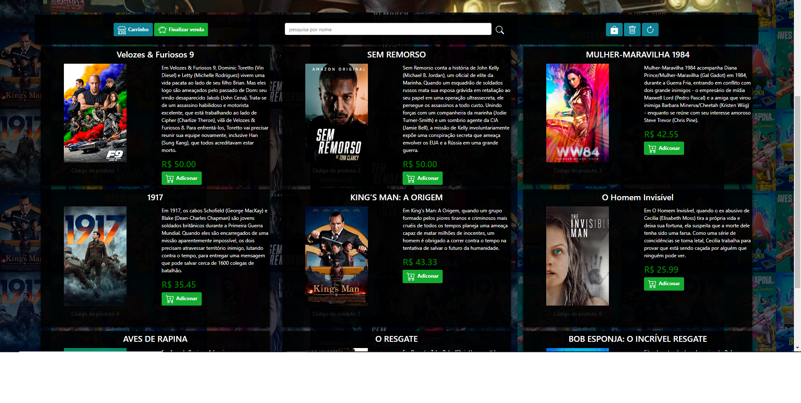

# SistemaFilmes

De forma resumida, é um sistema de administrador que envolve toda a parte de dashboards referidos ao conteúdo do site e além disso a parte visual em que o usuário (observa), o projeto tem o intuito de focar no código e o seu passo a passo, carrinho, finalização de venda e as partes dos produtos(filmes).

Sistema de vendas com PHP (não orientado a objeto)

Feito com o servidor XAMPP

Um projeto de escola feito para praticar os conhecimentos, o intuito era criar um sistema em que conseguimos cadastrar um produto, alterar e excluílo e também realizar uma venda com um cliente/usuário selecionado(logado).

